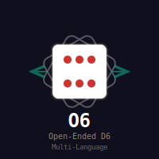

# O6

Open-ended D6 rolls implemented in various programming languages.

It works like this: You roll a six-sided dice. If you roll a 6, roll the dice again. If 4–6 is rolled, add 1 to the original roll (making it a 7) and roll the dice again, adding 1 to the original roll until you roll a 1, 2 or 3. If the original roll is a 1, roll the dice again, subtracting 1 from the original 1 if you roll 1–3. Keep rolling and subtracting until you end up rolling a 4, 5 or 6.Any two consequtive 1s indicates a "fumble" while two consequtive 6s indicates a "critical" roll.

There is no limit to the result you can get with an open ended dice roll, including negative results such as –5.

See [the Amar RPG wbsite](http:d6gaming.org/index.php/The_Character#Open_Ended_Rolls) for more.

Original not for my own code: So far it seems to me that Forth is the most compact code, while Vimscript and Fortran are the most verbose, with Julia and Nim perhaps being the most humanly readable - although I prefer to program in Ruby and FOCAL.

And then a [Julia thread popped
up](https://discourse.julialang.org/t/opportunity-to-write-some-idiomatic-julia-code/39702/21)
with lots of attack angles and really clever Julia code. I took one and
included it here as
[O6-julia2.jl](https://github.com/isene/O6/blob/master/O6-julia2.jl). This is
so far the coolest I've seen as an O6 implementation.
